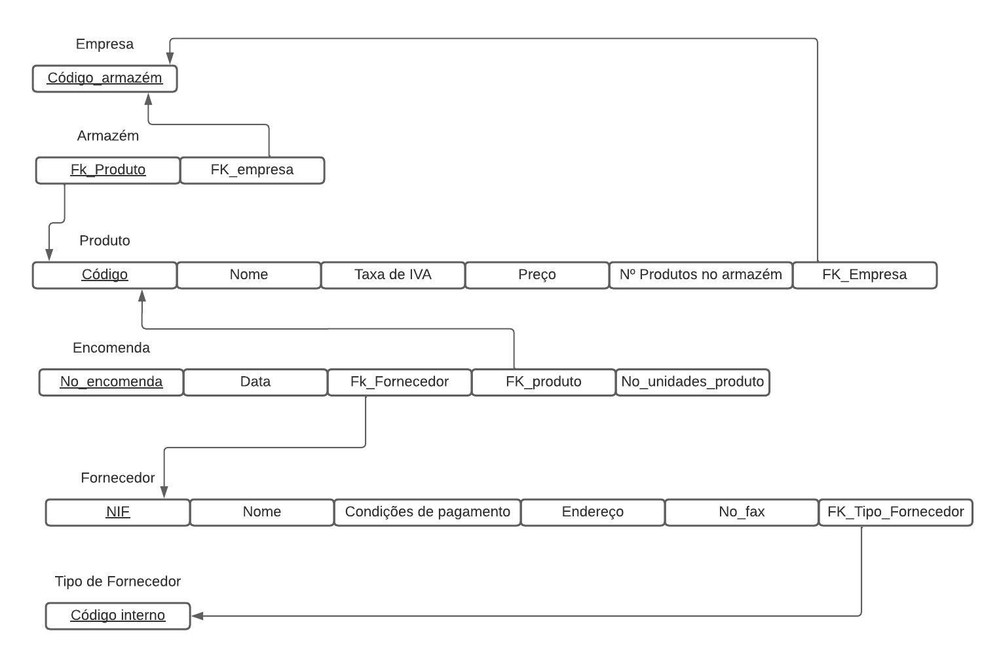

# BD: Guião 3


## ​Problema 3.1
 
### *a)*

```
Cliente(nome, endereco, num_carta, NIF, FK_Aluguer)
Aluguer(número, duracao, data, FK_Cliente, FK_Balcao)
Balcao(nome, número, endereço)
Veiculo(marca, matricula, ano)
Tipo_veiculo(designação, arcondicionado, codigo, FK_Veiculo)
Ligueiro(numlugares, portas, combustivel)
Pesado(peso, passagueiros)
Similaridade(Código1, Código2, FK_Tipo_veiculo)
```


### *b)* 

```
Cliente:
    Candidatas - NIF, num_carta
    Primárias - NIF
    Estrangeiras - FK_Aluguer

Aluguer:
    Candidatas - número
    Primárias - número
    Estrangeiras - FK_Cliente, FK_Balcao

Balcao:
    Candidatas - número, nome
    Primárias - número
    Estrangeiras - NULL

Veiculo:
    Candidatas - matrícula
    Primárias - matrícula
    Estrangeiras - NULL

Tipo_veiculo:
    Candidatas - código
    Primárias - código
    Estrangeiras - FK_Veiculo

Ligueiro:
    Candidatas - código
    Primárias - código
    Estrangeiras - NULL

Pesado:
    Candidatas - código
    Primárias - código
    Estrangeiras - NULL

Similaridade:
    Candidatas - NULL
    Primárias - Código1, Código2
    Estrangeiras - FK_Tipo_veiculo
```


### *c)* 


## ​Problema 3.2

### *a)*

```
Airport(Airport_code, City, State, Name)
Airplane_type(Company, Type_name, Max_seats)
Can_land(FK_Airport_code, FK_Airplane_Type)
Airplane(Airplane_id, Total_no_of_seats)
Flight_leg(Leg_on, Schedule_dep_time, Schedule_arr_time, Dep_airport_code, Arr_Airport_Code, FK_Flight, FK_Leg_Instance)
Leg_Instance(Date, No_of_available_seats, arr-time, Dep_time, FK_Flight_leg, FK_Airplane)
Flight(Number, Airline, Weekdays)
Fare(Restrictions, Amount, Code)
Seat(Seat_no, Costumer_Name, CPhone, FK_Leg_Instance)


```


### *b)* 

```
Airport:
    Candidatas - Airport_Code, Name
    Primárias - Airport_Code
    Estrangeiras - NULL

Airplane_Type:
    Candidatas - Type_Name
    Primárias - Type_Name
    Estrangeiras - NULL

Can_land:
    Candidatas - NULL
    Primárias - NULL
    Estrangeiras - FK_Airport_Code, FK_Airplane_Type

Airplane:
    Candidatas - Airplane_id
    Primárias - Airplane_id
    Estrangeiras - FK_Airplane_Type

Flight_leg:
    Candidatas - leg_no
    Primárias - leg_no
    Estrangeiras - FK_Flight, FK_Leg_instance

Flight:
    Candidatas - Number
    Primárias - Number
    Estrangeiras - NULL

Fare:
    Candidatas - Code
    Primárias - Code
    Estrangeiras - NULL

Seat:
    Candidatas - Seat_No
    Primárias - Seat_No
    Estrangeiras - FK_leg_instance
```


### *c)* 


## ​Problema 3.3


### *a)* 2.1



### *b)* 2.2


### *c)* 2.3


### *d)* 2.4

